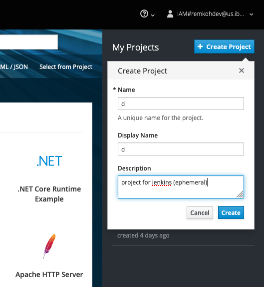
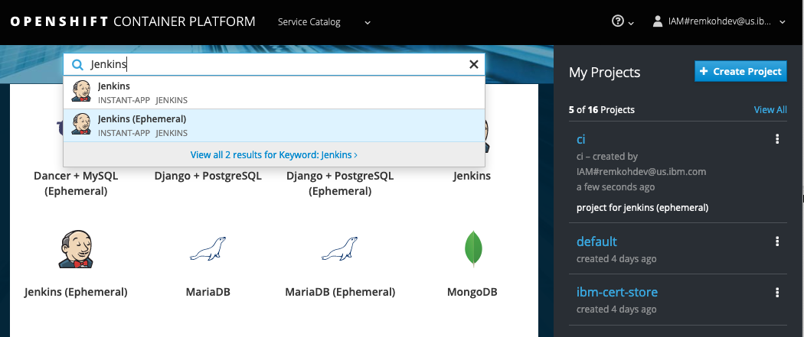
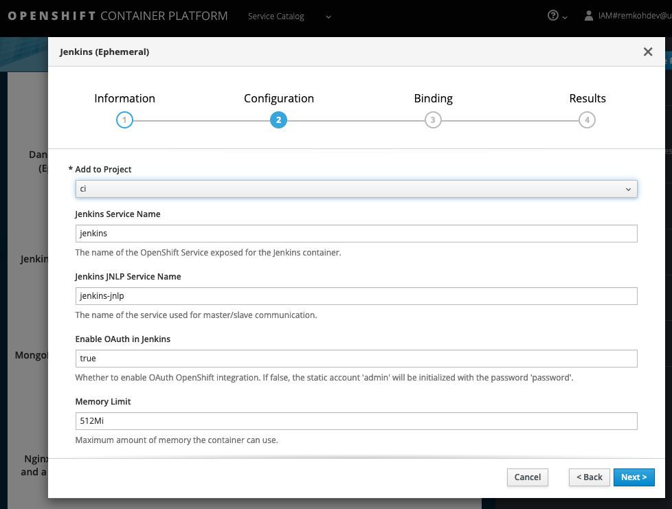
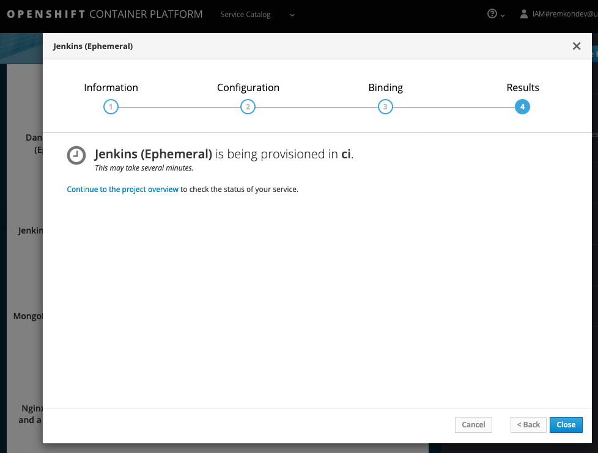
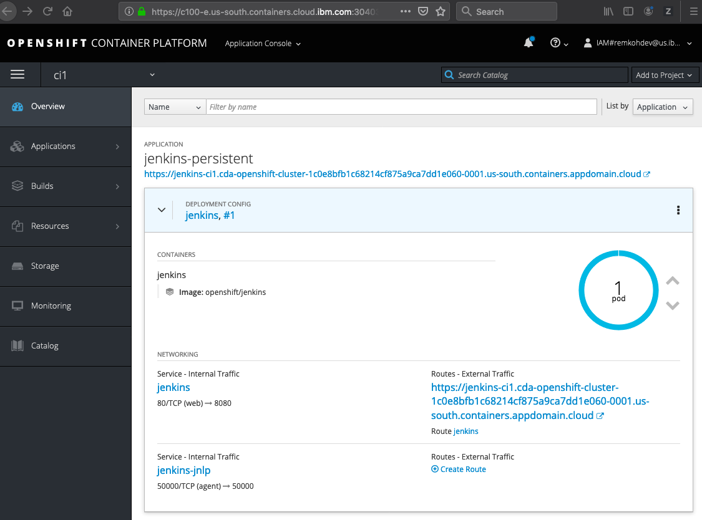
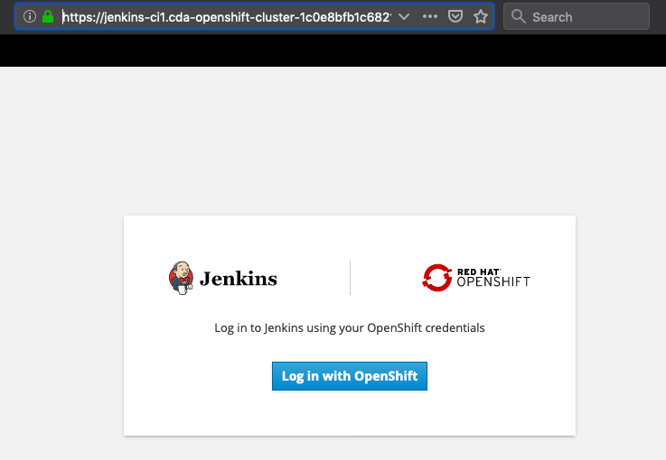
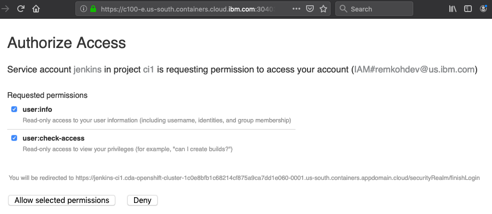
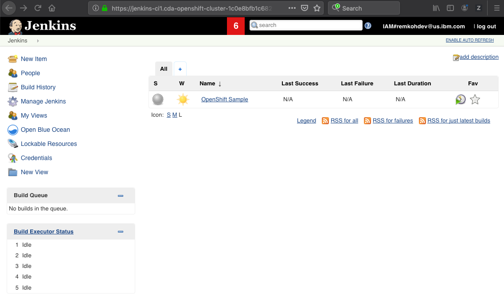

1. Setup Jenkins on OpenShift

	* From the IBM Cloud cluster dashboard, open the `OpenShift web console`,

		

	* Go to the `Service Catalog`,
	* Click the `+ Create Project` button,
    	* For `Name` enter `ci`,
    	* For `Desription` enter `Project for Jenkins`,
    	* Click `Create`,

		

	* Search the catalog for `Jenkins (Ephemeral)`, 
    	* Click the `Jenkins (Ephemeral)` service,

			

    	* Note that the ephemeral version does not include persistent storage, so your data will be lost if the pod goes down, but for this tutorial it is easier to setup,
    	* Click `Next`,

			

    	* For `Add to Project` select `ci`,

			

    	* Click `Next`,
    	* Check the option `Do not bind at this time`,
    	* Click `Create`,

			

    	* Click `Close` while Jenkins is being provisioned in ci,

			

  	* Go to your project `ci`,
  	* Go to `Overview`, and wait until Jenkins has been provisioned,
    	* If provisioning fails the first time because of a timeout during pulling of images, simply deploy the service again,
    	* To see the log for a deployment #1, go to Applicaitons > Deployments > Jenkins > #1,
    	* Click the `Logs` tab,

		


  	* Or go to `Monitoring` to see a detailed status,

		

	* Open Jenkins in a new tab by clicking the Jenkins deployment URL, e.g. https://jenkins-ci1.cda-openshift-cluster-1c0e8bfb1c68214cf875a9ca7dd1e060-0001.us-south.containers.appdomain.cloud,

		

	* Click `Log in with OpenShift`,
	* Clock `Allow selected permissions`,

		

	* Jenkins web will open,

		


2. [Optional] Run the Spring Boot Application on localhost,

	* Clone the source code of the Spring Client example,

		```console
		$ git clone https://github.com/remkohdev/springclient.git
		```

	* Run the Spring Client application,

		```console
		$ cd springclient
		$ mvn clean install
		$ mvn spring-boot:run
		```

	* Open a new console window, and test your application,

		```console
		$ curl -X GET 'http://localhost:8080/api/hello?name=pluto'
		```

3. Configure Jenkins

	* Add Maven,
    	* Go to Jenkins > Manage Jenkins > Global Tools Configuration,
    	* In the `Maven` section, click `Maven Installations`,
    	* If no Maven installer is configured, click `Add Maven`,
    	* Configure the `Name` to be `M3`, check the option `Install automatically` and select version `3.6.2`,
    	* Click `Save`,

4. Alternatively, instead of using the Blue Ocean editor to create the pipeline, you can create a pipeline using the regular Jenkins editor, here are the instructions:

	* Go to the Jenkins Dashboard,
	* Click `New Item`,
	* Enter an item name: `spring-client`,
	* Select `Pipeline`,
	* Click `OK`,

	* In the `General` tab, select `Github Project`,
	* In the `Project url` enter `https://github.com/<username>/spring-client.git`,
	* Under `Build Triggers`, select the option for `GitHub hook trigger for GITScm polling`,
	
	* Jenkins Pipeline supports two syntaxes, Declarative (introduced in Pipeline 2.5) and Scripted Pipeline,
	* Under `Pipeline`, in the `Pipeline script` box, paste the content of the `Jenkinsfile` included in the `sproing-client` repository, using `scripted pipeline` syntax, or select the ... option.
	* Click `Save`,
	* Click `Build Now`,